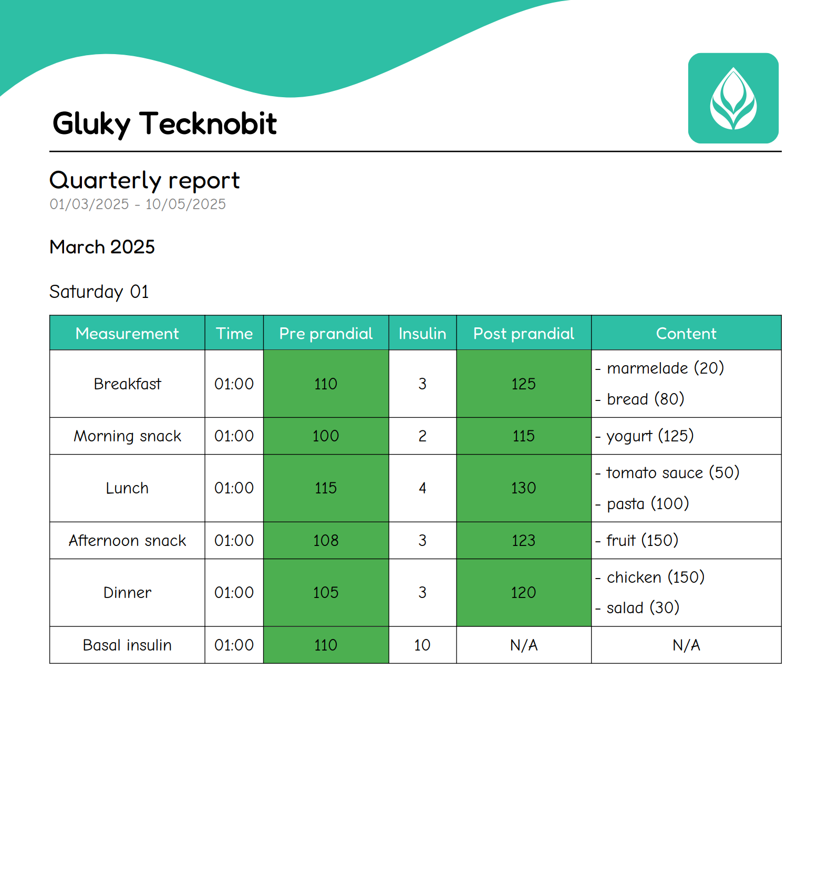

# Gluky

**v1.0.0**

This project is based on the `Spring Boot` framework and `Equinox` middle-framework, and it is the backend of an open
source application to daily tracking the glucose levels and meals.

`Gluky` allows the creation of custom reports based on one week, one month, three months and four months gap period
fully
customizable.
Following a report example:



> [!NOTE]  
> All the data have been random generated and are not related to anyone, for more information look
> to the [dataset](dataset/README.md)

Feel free to contribute!

## Customize the application

To customize and create your own version of this application you need to have
the <a href="https://github.com/N7ghtm4r3/Gluky/tree/main/core">core library</a>
implemented in your project and published into maven local system

### Clone the core library and publish to maven local

- Clone the repository or download the zip file of the current version available

- Open the folder file in your development environment and publish to maven local with the
  **publishMavenPublicationToMavenLocal** gradle task, take a
  look <a href="https://docs.gradle.org/current/userguide/publishing_maven.html">here</a>
  for a help

### Implement the core library to your application

- #### Gradle (Short)

```gradle
repositories {
  ...
  mavenLocal()
}

dependencies {
  implementation 'com.tecknobit.glukycore:glukycore:1.0.0'
}
```

#### Gradle (Kotlin)

```gradle
repositories {
  ...
  mavenLocal()
}

dependencies {
  implementation("com.tecknobit.glukycore:glukycore:1.0.0")
}
```

## Architecture

### Clients

- [Android](https://play.google.com/store/apps/details?id=com.tecknobit.gluky)
- [Gluky desktop version](https://github.com/N7ghtm4r3/Gluky-Clients/releases/tag/1.1.2)
- iOS -> source code available, but cannot distribute due
  missing [Apple Developer Program license](https://developer.apple.com/programs/)
- [Gluky webapp version](https://github.com/N7ghtm4r3/Gluky-WebApp)

### Backend

- [Backend service "out-of-the-box"](https://github.com/N7ghtm4r3/Gluky/releases/tag/1.0.0)

## Usages

### Backend configuration

> [!WARNING]  
> Note: the service will run using the *HTTP* protocol as default, it is recommended to implement an *SSL* or *TLS*
> certificate to secure communication on your infrastructure.
>
> **Wikis**
>
> To create a self-signed certificate you can
> look <a href="https://tecadmin.net/step-by-step-guide-to-creating-self-signed-ssl-certificates/">here</a>
>
> To implement a certificate in Spring you can
> look <a href="https://www.thomasvitale.com/https-spring-boot-ssl-certificate/">here</a>
>
> If you encounter any problems with the creation of the keystore you can
> look <a href="https://stackoverflow.com/questions/906402/how-to-import-an-existing-x-509-certificate-and-private-key-in-java-keystore-to">
> here</a> to get more information, or
> use the following command to add the **private key** to the keystore:
> ```xml
> openssl pkcs12 -export -in your_certificate_file.crt -inkey your_private_key.key -out your_out_pkcs12_file.p12 -name your_alias_name -CAfile your_certificate_file.crt -caname root
> ```

#### Default configuration

The default properties to launch the backend service as designed are the following:

| Property                                  | Default value                                                   |
|-------------------------------------------|-----------------------------------------------------------------|
| spring.datasource.url                     | jdbc:mysql://localhost:3306/gluky?createDatabaseIfNotExist=true |
| server.port                               | 1921                                                            |
| spring.datasource.username                | root                                                            |
| spring.jpa.generate-ddl                   | update                                                          |
| spring.jpa.hibernate.ddl.auto             | auto                                                            |
| spring.jpa.properties.hibernate.dialect   | org.hibernate.dialect.MySQL8Dialect                             |
| spring.mvc.dispatch-options-request       | true                                                            |
| spring.servlet.multipart.max-file-size    | 10MB                                                            |
| spring.servlet.multipart.max-request-size | 10MB                                                            |

The **spring.datasource.username** if is not set is used the default password of the MySQL environment

#### Custom configuration

To customize the properties to launch the backend service you must create a file **in the same folder where you placed
the server file (.jar)** and call it **"custom.properties"** as below:

``` bash
folderOfWhereYouPlacedTheServerFile
├── custom.properties
└── gluky.jar
```

If your custom properties do not contain the properties of the default configuration will be used these default
properties instead,
so if you need to change some default properties you have to overwrite them.

Take a look to the official page of **Spring** for a high
customization <a href="https://docs.spring.io/spring-boot/docs/current/reference/html/application-properties.html">
here</a>

### Run the service

To start the **Gluky** service on your own infrastructure you have to follow these steps

#### Requirements

- At least **Java 18 JDK** installed on your machine
- An SQL environment installed, it is recommended to use **MySQL**
- Before run the backend service, **for the first time only**, you need to store in the **profiles** subfolder
  **(created automatically by the server)** the default profile pic as below:
  ``` bash
    folderOfWhereYouPlacedTheServerFile
    ├── gluky.jar
    └── resources
        └── profiles
            └── defProfilePic.png
  ```
  This action is required because to provide the images media the service need an external place where store and fetch
  that media files, you can take a look directly <a href="https://github.com/N7ghtm4r3/Gluky/tree/main/images">
  here</a>
  to get more information and to get the **defProfilePic** file to store in the **profiles** subpath
- The SQL service running on "localhost:3306/gluky" by default, or if has been customized, with the custom data to
  format correctly the connection URL

## Support

If you need help using the library or encounter any problems or bugs, please contact us via the following links:

- Support via <a href="mailto:infotecknobitcompany@gmail.com">email</a>
- Support via <a href="https://github.com/N7ghtm4r3/Gluky/issues/new">GitHub</a>

Thank you for your help!

## Badges

[](https://play.google.com/store/apps/developer?id=Tecknobit)
[](https://twitter.com/tecknobit)

[](https://www.oracle.com/java/)
[](https://kotlinlang.org/)

[](https://spring.io/projects/spring-boot)

## Donations

If you want support project and developer

| Crypto                                                                                              | Address                                          | Network  |
|-----------------------------------------------------------------------------------------------------|--------------------------------------------------|----------|
|    | **3H3jyCzcRmnxroHthuXh22GXXSmizin2yp**           | Bitcoin  |
|  | **0x1b45bc41efeb3ed655b078f95086f25fc83345c4**   | Ethereum |
|        | **AtPjUnxYFHw3a6Si9HinQtyPTqsdbfdKX3dJ1xiDjbrL** | Solana   |

If you want support project and developer
with <a href="https://www.paypal.com/donate/?hosted_button_id=5QMN5UQH7LDT4">PayPal</a>

Copyright © 2025 Tecknobit